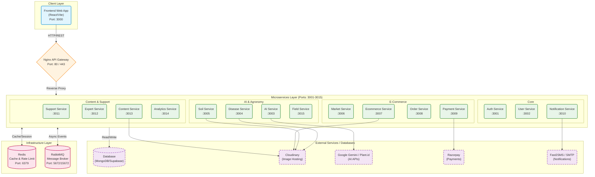

# Kissan Mithar Consultancy (KMC) Architecture Overview

This document provides a comprehensive overview of the KMC microservices architecture, detailing the frontend applications, the API gateway, all 15 microservices, infrastructure dependencies, port mappings, and communication flows.

> [!TIP]
> **Quick Start for Developers**: To run the entire stack locally, you can use `docker-compose up -d` from the `microservices` directory. This will spin up the Nginx gateway, Redis, RabbitMQ, all 15 backend microservices, and both frontends.

## System Architecture Diagram

## Detailed Port Mapping & Responsibilities

The project is structured with an API Gateway handling all incoming traffic and routing it to the appropriate backend microservice. They share Redis for caching and RabbitMQ for asynchronous event-driven communication.

### 1. Client Layer

| Application | Port | Description |
| :--- | :--- | :--- |
| **Frontend Web** | `3000` | The main React application for web users. |

### 2. Infrastructure Layer

| Service | Port(s) | Description |
| :--- | :--- | :--- |
| **Nginx API Gateway** | `80`, `443` | The central entry point. Handles rate-limiting, SSL termination, and routes traffic to microservices. |
| **Redis** | `6379` | In-memory data store used for caching, session management, and Nginx rate-limiting zones. |
| **RabbitMQ** | `5672`, `15672` | Message broker for asynchronous communication between microservices (e.g., Order service telling Notification service to send an email). Port 15672 is the management UI. |

### 3. Microservices Layer

All microservices are Node.js applications configured to connect to MongoDB/Supabase, Redis, and RabbitMQ via environment variables.

| Microservice | Port | Key Responsibilities | External Dependencies |
| :--- | :--- | :--- | :--- |
| **Auth Service** | `3001` | User authentication, JWT issuance, Supabase integration, SMS/Email OTPs. | Fast2SMS |
| **User Service** | `3002` | User profile management, role management (Farmer, Expert, Admin). | - |
| **AI Service** | `3003` | Core AI functionality, chat bots, prompt generation. | Gemini API, Plant.id |
| **Disease Service** | `3004` | Crop disease detection, image analysis, treatment recommendations. Connects to AI service internally. | Cloudinary |
| **Soil Service** | `3005` | Soil health analysis, crop suitability, fertilizer recommendations. Connects to AI service internally. | Cloudinary |
| **Market Service** | `3006` | Live market prices, commodity trends, mandi prices. | Data.gov API |
| **Ecommerce Service**| `3007` | Product catalog, inventory management (fertilizers, equipment, seeds). | Cloudinary |
| **Order Service** | `3008` | Shopping cart, checkout process, order history, tracking. | - |
| **Payment Service** | `3009` | Payment gateway integration, transaction verification, invoice generation. | Razorpay API |
| **Notification Svc.** | `3010` | Centralized sending of Emails, SMS, and Push notifications. Listens to RabbitMQ queues. | Fast2SMS, SMTP |
| **Support Service** | `3011` | Customer support ticketing, FAQs, contact forms. | - |
| **Expert Service** | `3012` | Booking consultations with agronomy experts, scheduling, video call links. | - |
| **Content Service** | `3013` | Blogs, articles, farming best practices, weather updates. | Cloudinary |
| **Analytics Service** | `3014` | System-wide analytics, dashboard metrics, reporting for admins. | - |
| **Field Service** | `3015` | Farm/Field mapping, crop lifecycle tracking, task management for specific fields. | - |

## Communication Flow

1. **Synchronous (REST/HTTP)**:
   - Client applications send requests to the **Nginx Gateway** (`localhost:80` / `localhost:443`).
   - Nginx uses its `upstream` configurations to resolve the Docker DNS and forward the request to the specific microservice based on the URL path (e.g., `/api/v1/auth/*` goes to Auth Service on port `3001`).
   - Some services communicate synchronously with each other. For example, `Disease Service` and `Soil Service` have the `AI_SERVICE_URL` explicitly passed to them so they can call the AI service directly for processing.

2. **Asynchronous (Event-Driven)**:
   - When a user places an order, the `Order Service` saves the order and publishes an event to **RabbitMQ**.
   - The `Payment Service` might listen to this to initiate a payment flow, and the `Notification Service` listens to it to send an "Order Confirmation" email/SMS. This prevents the initial HTTP request from hanging while emails are being sent.

3. **Data & Caching**:
   - Each service manages its own database interactions (MongoDB/Supabase) to ensure loose coupling.
   - Heavy queries or session data (like JWT blocklists or rate-limiting states) are stored in **Redis**.

## Environment Configuration
The system relies on a central `.env` file located in the `microservices/` directory. It contains all connection strings:
- `MONGODB_URI` / `SUPABASE_URL`
- `REDIS_URL`
- `RABBITMQ_URL`
- API Keys for Gemini, Razorpay, Cloudinary, Fast2SMS, etc.
