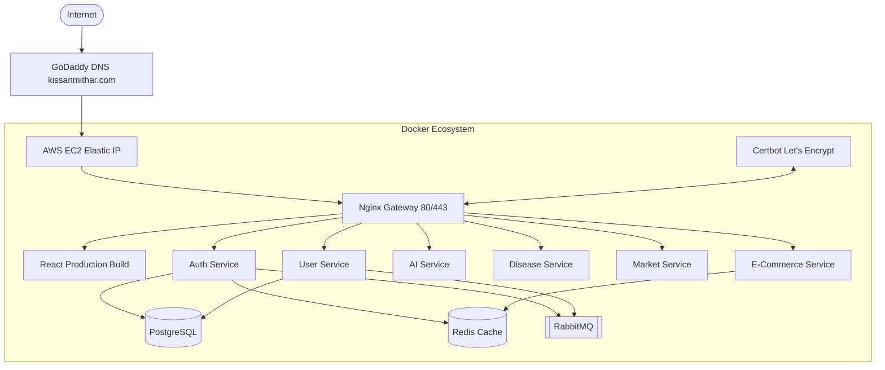

# KMC System Architecture

This outlines the high-level infrastructure of the Kissan Mithar Consultancy (KMC) production platform.

## Nginx Gateway Strategy
- Terminates SSL via Let's Encrypt Certbot
- Proxies `/*` to React frontend statically compiled inside Nginx on port 80
- Rate limits various endpoints (`/api/auth/farmer/send-otp` is highly restricted)
- Attaches X-Request-ID to trace calls across microservices
- Adds strict Security Headers

## Microservices Layer
We employ 15 specialized Node.js microservices for modular scale. Internal routing occurs via Docker's internal DNS (`127.0.0.11`). The Nginx gateway handles round-robin balancing naturally without breaking on container restarts.
