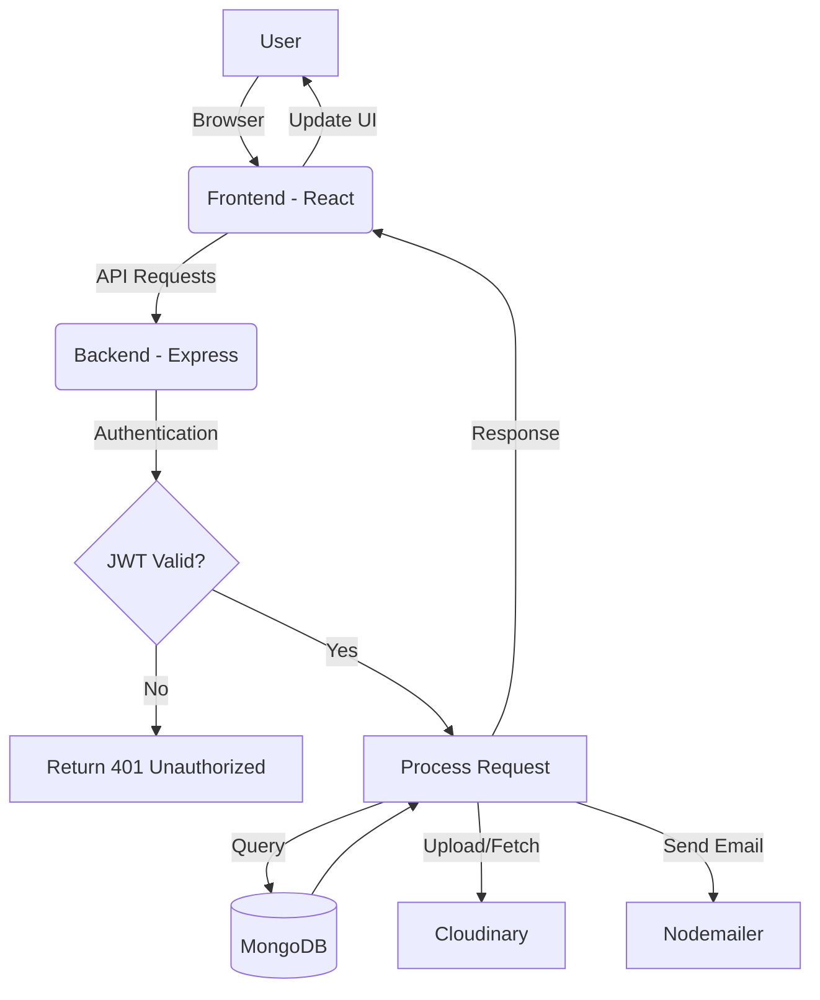

# KMC Project Architecture & Workflow

This document provides a comprehensive overview of the KMC (Kisan Management Center) project, detailing its architecture, tech stack, folder structure, and operational workflows.

---

## 1. Project Overview

KMC is a full-stack web application designed to empower farmers by providing essential agricultural services, information, and a marketplace for farming supplies. It serves as a centralized hub for:
- **Expert Advice**: Soil testing, crop selection, and advisor consultations.
- **Resource Management**: Marketplace for fertilizers and farming equipment.
- **Information Hub**: Agricultural blogs, success stories, and real-time market prices.
- **Admin Control**: Comprehensive dashboard for managing users, products, and platform data.

The project follows a modern MERN-like architecture with a decoupled frontend and backend, ensuring scalability and ease of maintenance.

---

## 2. Learning Outcomes

By exploring or developing this project, one gains proficiency in:
- **Full-Stack Development**: Integrating a React frontend with a Node/Express backend.
- **Database Designing**: Using Mongoose for complex data modeling and relationships.
- **State Management**: Handling global state and navigation in a multi-page React app.
- **RESTful API Design**: Creating secure and efficient endpoints for CRUD operations.
- **Third-Party Integrations**: Implementing Cloudinary for image hosting, Nodemailer for emails, and payment/SMS gateways.
- **Admin Dashboards**: Building interactive analytics and management interfaces.
- **Security Best Practices**: Implementing JWT-based authentication and role-based access control (RBAC).

---

## 3. Tech Stack

### Frontend
- **Framework**: [React.js](https://reactjs.org/) (Vite)
- **Styling**: [Tailwind CSS](https://tailwindcss.com/)
- **Icons**: [Lucide React](https://lucide.dev/), [React Icons](https://react-icons.github.io/react-icons/)
- **State/Routing**: [React Router DOM](https://reactrouter.com/)
- **Charts**: [Recharts](https://recharts.org/)
- **Notifications**: [React Toastify](https://fkhadra.github.io/react-toastify/)
- **HTTP Client**: [Axios](https://axios-http.com/)

### Backend
- **Environment**: [Node.js](https://nodejs.org/)
- **Framework**: [Express.js](https://expressjs.com/)
- **Database**: [MongoDB](https://www.mongodb.com/) (Mongoose ODM)
- **Authentication**: [JSON Web Tokens (JWT)](https://jwt.io/), [BcryptJS](https://github.com/dcodeIO/bcrypt.js)
- **Media Storage**: [Cloudinary](https://cloudinary.com/)
- **Email/SMS**: [Nodemailer](https://nodemailer.com/), [Fast2SMS](https://www.fast2sms.com/)
- **Middleware**: Multer (file uploads), Cookie Parser, CORS.

---

## 4. Folder Structure

### Backend
```text
KMC/Backend/
├── config/             # Database, Cloudinary, and SMS configurations
├── controllers/        # Logical implementation of API endpoints
├── middleware/         # Authentication and error-handling middleware
├── models/             # Mongoose schemas for MongoDB
├── routes/             # Express route definitions
├── seedData.js         # Scripts to populate the database with initial data
├── server.js           # Main entry point of the server
└── vercel.json         # Deployment configuration for Vercel
```

### Frontend
```text
KMC/Frontend/
├── public/             # Static assets (favicons, etc.)
├── src/
│   ├── assets/         # Images and icons used in the UI
│   ├── components/     # Reusable UI components (Navbar, Footer, Admin layouts)
│   ├── context/        # React Context for global state management
│   ├── pages/          # Individual page components (Auth, Admin, Farming, etc.)
│   ├── App.jsx         # Main routing configuration
│   └── main.jsx        # Application entry point
├── vite.config.js      # Vite build configuration
└── vercel.json         # Deployment configuration for Vercel
```

---

## 5. System Architecture & Workflow

### User Interaction Workflow


---

## 6. Database Schema Details

The system uses several Mongoose models to manage data:
- **User**: Stores credentials, roles (Admin/User), and profile info.
- **Blog**: Content for agricultural updates with slugs for SEO.
- **Equipment & Fertilizer**: Product details for the marketplace.
- **Order/EquipmentOrder**: Tracking purchases and customer details.
- **MarketPrice**: Real-time or updated pricing for crops.
- **SuccessStory**: Testimonials and case studies.
- **Booking**: Farm visit or consultation schedules.

---

## 7. How to Run + Quick Tests

### Prerequisites
- Node.js (v16 or higher)
- MongoDB account (Atlas or Local)
- Cloudinary Account (for media)

### Setup Instructions
1.  **Clone the Repo**:
    ```bash
    git clone <repo-url>
    cd KMC
    ```
2.  **Backend Setup**:
    ```bash
    cd Backend
    npm install
    # Create a .env file based on existing .env structure
    npm start
    ```
3.  **Frontend Setup**:
    ```bash
    cd ../Frontend
    npm install
    # Create a .env file with VITE_BACKEND_URL
    npm run dev
    ```

### Quick Tests
- **Auth Test**: Create a new account and verify if you can log in.
- **API Health**: Visit `http://localhost:4000/` to check if the server is running.
- **Admin Access**: Log in with an admin account and check if the `/admin/dashboard` loads metrics.

---

## 8. Debugging Techniques

- **Console Logging**: Use `console.log` on the backend to trace request payloads (`req.body`) and database results.
- **Network Tab**: Use Chrome DevTools Network tab to inspect failing API calls (check status codes like 404, 500).
- **Redux/Context DevTools**: Inspect state changes if using global state.
- **Mongoose Debug Mode**: Enable `mongoose.set('debug', true)` to see raw MongoDB queries.
- **Tailwind Inspection**: Use the browser inspector to debug styling issues and responsive breakpoints.

---

## 9. Security & Deployment

- **JWT Secrets**: All sensitive tokens are stored in environment variables, never committed to VCS.
- **CORS Configuration**: Restricts API access to authorized frontend domains.
- **Deployment**: Both Frontend and Backend are configured for deployment on **Vercel** using `vercel.json` files.
- **Role-Based Access**: Specialized middleware ensures only Admins can access `/api/admin` routes.

---

> [!TIP]
> To convert this document to a PDF, you can use the **Markdown PDF** extension in VS Code or any online Markdown-to-PDF converter.
