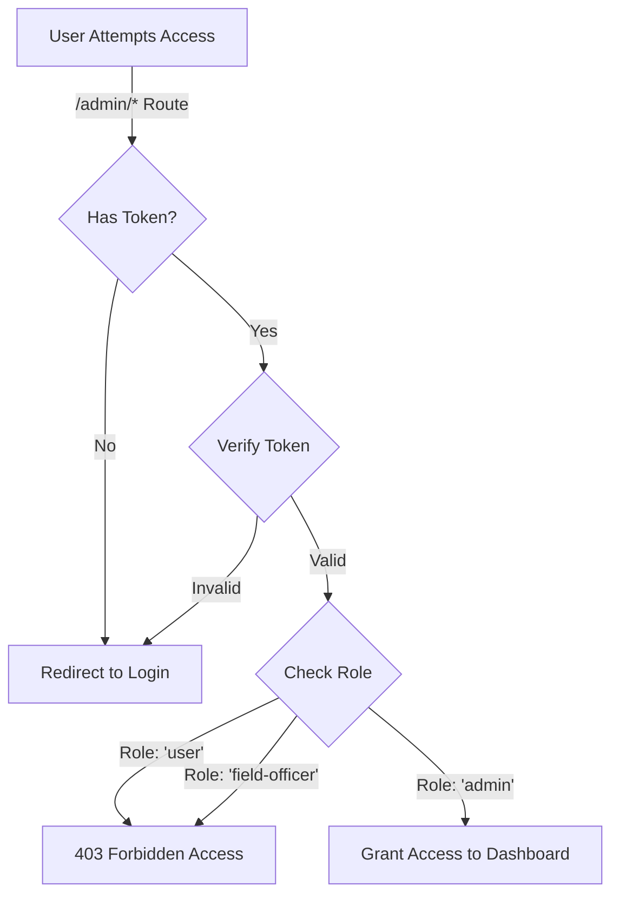

# KisanMithar Core (KMC) - Technical Documentation

**Version:** 1.4.0
**Last Updated:** February 15, 2026
**Author:** Generated by Antigravity (Google DeepMind)

---

## 1. Executive Summary

### 1.1 Problem Statement
The agricultural sector currently faces a "Knowledge-Action Gap." Farmers are often disconnected from the scientific and market realities that dictate profitability. This gap manifests in three critical areas:

*   **Information Asymmetry:** Farmers frequently rely on generational knowledge or hearsay rather than scientific data for crop selection and disease management. This leads to preventable crop failures and lower yields.
*   **Supply Chain Inefficiencies:** The market for essential inputs like fertilizers and equipment is fragmented. Intermediaries often struggle to provide transparent pricing or quality assurance, driving up costs for the end farmer.
*   **Advisory Accessibility:** Access to qualified agricultural scientists (Field Officers) is geographically limited. Farmers cannot easily "book" an expert visit, leaving them unsupported during critical infestation or planting periods.

### 1.2 Solution: KisanMithar Core (KMC)
KMC solves these problems by digitizing the agricultural lifecycle. It is a centralized platform that integrates:
*   **Direct-to-Farmer Marketplace:** Eliminating middlemen for fertilizers and equipment.
*   **On-Demand Advisory:** A booking system for physical farm visits by experts.
*   **Data-Driven Decision Making:** Real-time market prices and weather-aligned crop advice.

### 1.3 Business Impact
*   **Yield Maximization:** Timely expert advice and correct input usage can increase crop yields significantly.
*   **Cost Reduction:** Direct sourcing of equipment and fertilizers reduces input costs for farmers.
*   **Operational Efficiency:** Digitizing records allows for better policy-making and resource allocation by administrators.

---

## 2. System Architecture

The project follows a decoupled **Client-Server Architecture** using the MERN stack.

```mermaid
graph TD
    User((User/Farmer)) -->|HTTPS| Frontend[Frontend (React + Vite)]
    Admin((Admin)) -->|HTTPS| Frontend
    
    Frontend -->|REST API| Backend[Backend API (Node.js + Express)]
    
    Backend -->|Auth Middleware| AuthLogic{JWT Validation}
    AuthLogic -- Valid --> Controllers[Controllers]
    
    Controllers -->|Mongoose ODM| DB[(MongoDB Atlas)]
    Controllers -->|Media Upload| Cloudinary[Cloudinary]
    Controllers -->|Email/SMS| Comms[Nodemailer / Fast2SMS]
    
    DB --> Controllers
    Controllers --> Backend
    Backend -->|JSON Response| Frontend
```

### 2.1 User Interaction Workflow
The following steps describe the detailed data flow when a user interacts with the KMC platform:

1.  **User Action (Frontend)**: The user interacts with the React UI (e.g., clicks "Book Visit"). This triggers an asynchronous `Axios` HTTP request to the Backend API.
2.  **API Routing (Backend)**: The `Express.js` server receives the request and uses the URL path to route it to the appropriate endpoint (e.g., `POST /api/booking`).
3.  **Authentication Layer**: The `userAuth` middleware intercepts the request before it reaches the controller. It extracts the JWT from the `httpOnly` cookie and validates its cryptographic signature. If invalid, a `401 Unauthorized` response is returned immediately.
4.  **Business Logic (Controller)**: Once authenticated, the request is passed to the specific Controller function. Here, input data is validated, and business rules are applied (e.g., checking if the chosen time slot is available).
5.  **Data Persistence (Database)**: The Controller uses `Mongoose` models to perform Create, Read, Update, or Delete (CRUD) operations on the MongoDB Atlas database.
6.  **Response Handling**: The Backend sends a standardized JSON response (success status and data) back to the Frontend. The React Frontend updates its state (e.g., Context or Local State) and the UI reflects the change (e.g., showing a "Booking Confirmed" toast notification).

---

## 3. Admin Panel Architecture

The Admin Panel is a secured, isolated interface designed for system oversight. It uses a strict **Role-Based Access Control (RBAC)** mechanism to ensure only authorized personnel can access sensitive data.

### 3.1 Access Control Logic
Access is governed by the `adminAuth` middleware, which performs a dual-check:
1.  **Authentication:** Verifies the JWT token from the `httpOnly` cookie is valid and not expired.
2.  **Authorization:** Decodes the token to verify `user.role === 'admin'`.

### 3.2 Access Flow Chart



### 3.3 Dashboard Capabilities
Once authenticated, the Admin has exclusive access to:
*   **Analytics:** Real-time graphs for revenue, user growth, and crop distribution.
*   **User Management:** Approve/Reject new farmer registrations and manage field officers.
*   **Content Management:** Publish blogs, success stories, and update market prices.
*   **Inventory Control:** Add/Edit/Delete fertilizers and equipment.

---

## 4. User Roles & Access Control

The system implements strict **Role-Based Access Control (RBAC)** to ensure data security.

| Role              | Access Level | Key Capabilities                                                                                                                           |
| :---------------- | :----------- | :----------------------------------------------------------------------------------------------------------------------------------------- |
| **Farmer (User)** | Basic        | • Browse Products & Blogs<br>• Book Farm Visits<br>• Place Orders<br>• View Market Prices                                                  |
| **Field Officer** | Intermediate | • View Assigned Bookings<br>• Update Booking Status (Pending → Completed)<br>• Submit Visit Reports                                        |
| **Admin**         | Full Control | • User Management (Approve/Reject Farmers)<br>• Product Inventory Management<br>• Analytics Dashboard<br>• Manage Content (Blogs, Stories) |

---

## 5. Frontend Architecture

The frontend is built with **React 18** and **Vite**.

### Core Modules
*   **Authentication Wrapper:** `AuthContext` provides user state to the entire app.
*   **Admin Dashboard:** Uses nested routing in `react-router-dom` to render a sidebar layout with dynamic content panels.
*   **Marketplace UI:** Grid layouts with filterable product lists using `useMemo` for performance.

---

## 6. Backend Architecture & Folders

### Backend Structure
| Directory      | Description                                                            |
| :------------- | :--------------------------------------------------------------------- |
| `config/`      | Database (MongoDB), Cloudinary, and SMS configurations.                |
| `controllers/` | Business logic (e.g., `bookingController.js` handles slot validation). |
| `middleware/`  | `adminAuth.js` (Role checks) and `userAuth.js` (Token checks).         |
| `models/`      | Mongoose schemas (e.g., `User`, `Order`, `Booking`).                   |
| `routes/`      | API route definitions mapping URLs to controllers.                     |

---

## 7. Operational Workflows

### 7.1 Farm Visit Booking Cycle
1.  **Request:** Farmer logs in, selects a date, and submits a "Request for Visit".
2.  **Assignment:** Admin/System assigns a `Field Officer` to the request based on District/Location.
3.  **Execution:** Field Officer visits the farm on the scheduled date.
4.  **Completion:** Officer marks the booking as "Completed" in the system.

### 7.2 E-Commerce Order Cycle
1.  **Selection:** Farmer adds Fertilizers/Equipment to the cart.
2.  **Checkout:** System validates stock availability in `Product` collection.
3.  **Creation:** An `Order` document is created with status "Processing".
4.  **Fulfillment:** Admin updates status to "Shipped" -> "Delivered".

---

## 8. Database Schema Design (Key Models)

### User Collection
```javascript
{
  name: String,
  email: { type: String, unique: true },
  role: { type: String, enum: ['user', 'admin', 'field-officer'] },
  district: String,
  crops: [String], // Array of crops they grow
  isAccountVerified: Boolean
}
```

### Booking Collection
```javascript
{
  farmerId: ObjectId (Ref: User),
  visitDate: Date,
  assignedOfficer: ObjectId (Ref: User),
  status: { type: String, enum: ['Pending', 'Confirmed', 'Completed'] },
  notes: String
}
```

---

## 9. API Documentation Summary

### Authentication (`/api/auth`)
*   `POST /login`: Validates credentials, sets HTTP-Only cookie.
*   `POST /verify-otp`: Multifactor authentication support.

### Admin Operations (`/api/admin`)
*   `GET /dashboard-stats`: Aggregated data for analytics charts.
*   `PATCH /users/:id/role`: Promote users/officers.

### Marketplace (`/api/products`)
*   `GET /`: List all products (supports pagination `?page=1`).
*   `GET /:id`: Product details.

---

## 10. Security & Error Handling

*   **XSS Protection:** Tokens stored in `HttpOnly` cookies, inaccessible to JavaScript.
*   **Input Validation:** All API inputs are validated at the controller level before DB queries.
*   **Global Error Handler:** Centralized middleware catches async errors and sends standardized JSON responses.

---

## 11. Deployment & Scalability

### Deployment
*   **Frontend:** Deployed on **Vercel** (Static Site Generation).
*   **Backend:** Deployed on **Vercel** (Serverless Functions) or specialized Node.js hosting.
*   **Database:** Hosted on **MongoDB Atlas** (Managed Cloud Database).

### Scalability
*   **Stateless API:** The backend is RESTful and stateless, allowing easy horizontal scaling.
*   **CDN:** Images and static assets are delivered via global CDNs (Cloudinary/Vercel Edge).

---

## 12. Future Scope & Roadmap

KMC is built with extensibility in mind. The following features are planned for future releases to enhance the platform's utility and reach.

### 12.1 Payment Gateway Integration
Currently, orders are processed manually or via Cash-on-Delivery (COD).
*   **Objective:** Enable secure, real-time online payments.
*   **Implementation:** Integration with **Razorpay** or **Stripe** API.
*   **Benefits:** Reduces financial risk for the platform, automates payment reconciliation, and provides a seamless checkout experience for farmers.

### 12.2 AI-Powered Advisory
Leveraging Machine Learning to provide instant, automated crop health assessments.
*   **Objective:** Allow farmers to upload photos of diseased crops and receive instant diagnosis and remedy suggestions.
*   **Implementation:** Training a Convolutional Neural Network (CNN) model (e.g., TensorFlow Lite) on a dataset of crop diseases.
*   **Benefits:** 24/7 advisory availability, reducing the load on human Field Officers.

### 12.3 Smart Logistics & Tracking
Integrating with third-party logistics providers.
*   **Objective:** Provide real-time tracking updates for fertilizer and equipment orders.
*   **Implementation:** API integration with services like **Shiprocket** or **Delhivery**.
*   **Benefits:** Increases trust and transparency; farmers can see exactly when their supplies will arrive.

### 12.4 Vernacular Language Support (i18n)
Breaking language barriers to reach the rural heartland.
*   **Objective:** Make the platform accessible to non-English speaking farmers.
*   **Implementation:** Using `react-i18next` to support regional languages like **Hindi, Telugu, and Tamil**.
*   **Benefits:** Massively expands the user base and ensures critical advisory information is understood correctly.
